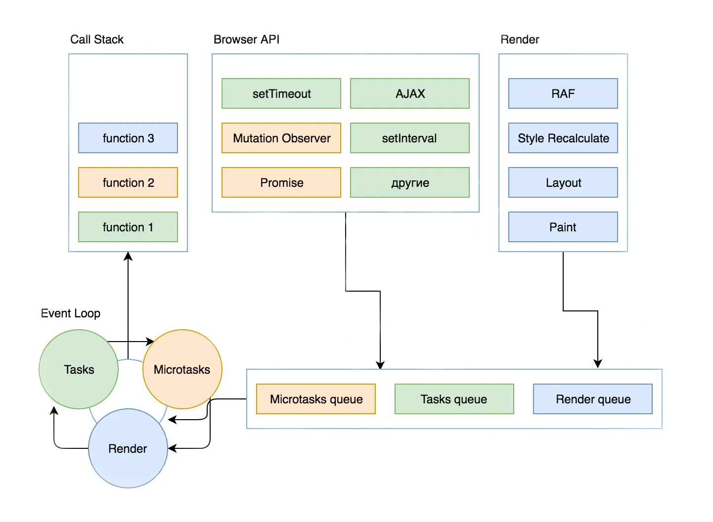

#### Clousure

```
function outerFunction() {
	let outerVar = 'I am from the outer function';

	function innerFunction() {
		console.log(outerVar);
	}

	return innerFunction;
}

const closureFunction = outerFunction();
closureFunction(); // Output: "I am from the outer function"
```


#### FunctionFactory

```javascript
// Function factory that creates a greeting function
function createGreetingFunction(greeting) {
	return function (name) {
		return `${greeting}, ${name}!`;
	};
}

// Create two greeting functions using the factory
const sayHello = createGreetingFunction('Hello');
const sayGoodbye = createGreetingFunction('Goodbye');

// Use the generated functions
console.log(sayHello('John')); // Output: "Hello, John!"
console.log(sayGoodbye('Jane')); // Output: "Goodbye, Jane!"
```

#### Memoization

```javascript
function factorial(n) {
	// Base case: Return 1 for n=0 and n=1
	if (n === 0 || n === 1) {
		return 1;
	}

	// Check if the result is already memoized
	if (factorial.memo === undefined) {
		factorial.memo = {};
	}

	if (factorial.memo[n] !== undefined) {
		// Return the cached result if available
		return factorial.memo[n];
	}

	// Calculate the result for new inputs and memoize it
	factorial.memo[n] = n * factorial(n - 1);
	return factorial.memo[n];
}

console.log(factorial(5)); // Output: 120 (Memoized result used)
console.log(factorial(8)); // Output: 40320 (Memoized result used)
```


#### Async/Await

```javascript
// Function that returns a Promise
function fetchData() {
	return new Promise((resolve, reject) => {
		setTimeout(() => {
			const data = { name: "John", age: 30 };
			resolve(data);
		}, 2000);
	});
}

// Using Async/Await
async function fetchDataAsync() {
	try {
		const data = await fetchData();
		console.log("Data:", data);
	} catch (error) {
		console.error("Error:", error);
	}
}

// Call the async function
fetchDataAsync();

```

#### Promise

```javascript
// Function that returns a Promise
function fetchData() {
	return new Promise((resolve, reject) => {
		// Simulating an asynchronous operation (e.g., fetching data from an API)
		setTimeout(() => {
			const data = { name: "John", age: 30 };
			// Simulate success
			resolve(data);
			// Simulate failure
			// reject(new Error("Failed to fetch data"));
		}, 2000); // Resolve after 2 seconds
	});
}

// Using the Promise
fetchData()
	.then((data) => {
		console.log("Data:", data);
	})
	.catch((error) => {
		console.error("Error:", error);
	});

```

#### Prototype Inheritance

```javascript
// Parent Constructor Function
function Animal(name) {
	this.name = name;
}

// Prototype Method
Animal.prototype.sayHello = function () {
	console.log(`Hello, I'm ${this.name}.`);
};

// Child Constructor Function
function Dog(name, breed) {
	// Call parent constructor using 'call' or 'apply' to set the context and inherit properties
	Animal.call(this, name);
	this.breed = breed;
}

// Set up prototypal inheritance
Dog.prototype = Object.create(Animal.prototype);
Dog.prototype.constructor = Dog;

// Add a method to the child prototype
Dog.prototype.bark = function () {
	console.log('Woof!');
};

// Create instances
const animal = new Animal('Generic Animal');
const dog = new Dog('Buddy', 'Golden Retriever');

// Access properties and methods
animal.sayHello(); // Output: Hello, I'm Generic Animal.
dog.sayHello();    // Output: Hello, I'm Buddy.
dog.bark();        // Output: Woof.

```


#### Generator

```javascript
function* numberGenerator() {

  yield 1;
  yield 2;
  yield 3;
}

// Create an instance of the generator
const generator = numberGenerator();

// Using the generator to produce values
console.log(generator.next()); // { value: 1, done: false }
console.log(generator.next()); // { value: 2, done: false }
console.log(generator.next()); // { value: 3, done: false }
console.log(generator.next()); // { value: undefined, done: true }
```


#### Event Looping




The only place through which tasks can get into the Call Stack and be executed is the Event Loop. His job is to keep up with the tasks.

* Personal — execution of the main JavaScript code on the site (hereinafter we will assume that it has already been executed)
* Tasks from customers — Render, Microtasks and Tasks

Most likely, personal tasks will be your priority. **Event Loop** agrees with this. It remains to streamline the tasks from the customer. Of course, the first thing that comes to mind is to give each customer a priority and line them up. The second is to determine how exactly the tasks from each customer will be processed — one at a time, all at once, or maybe in groups.


Based on this scheme, the entire operation of the **Event Loop** is built. After we started executing a script, a task with the execution of this script is put in the  **Tasks queue** . As this code is executed, we encounter tasks from different customers, which are placed in the appropriate queues. After the task to execute the script (a task from Tasks) is completed, the **Event Loop** goes to **Microtasks** (after the task from Tasks, the Event Loop takes tasks from Microtasks). The **Event Loop** takes tasks from him until they run out. This means that if the time they were added is equal to the time they were executed, then the **Event Loop** will process them indefinitely.

Then it goes to **Render** and performs tasks from it. Tasks from **Render** are optimized by the browser, and if it considers that nothing needs to be redrawn in this cycle, then the **Event Loop** will simply go further. Next, the **Event Loop** again takes tasks from Tasks and asks it for only one, the first task in the queue, transfers it to the CallStack and goes further along the cycle.

If one of the customers did not have tasks, then the **Event Loop** simply goes to the next one. And vice versa, if the tasks take a lot of time for the customer, then the rest of the customers will wait for their turn. And if the tasks from some customer turned out to be endless, then the *Call Stack* overflows, and the browser starts to display an error window.
